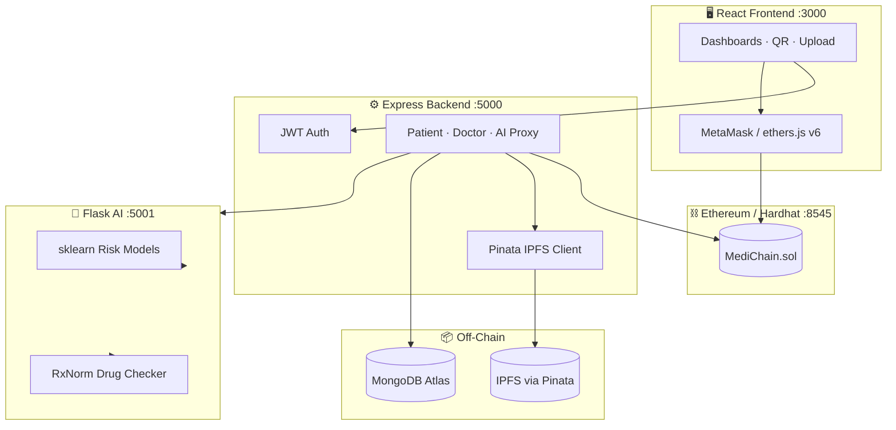
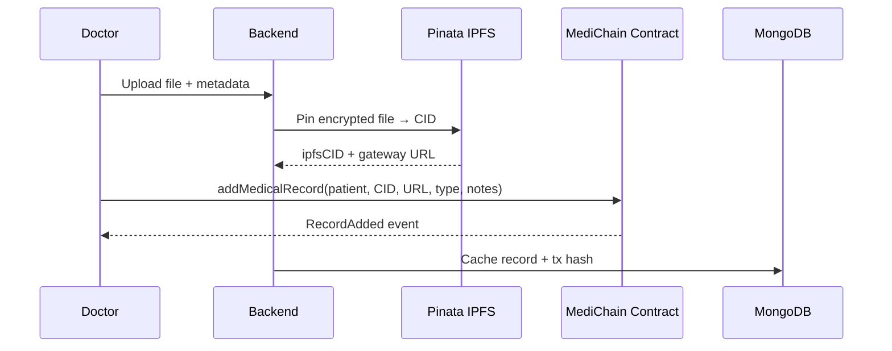

<div align="center">

# MediChain

### Decentralised Electronic Health Records — patient-owned, blockchain-verified, AI-assisted

[](LICENSE)
[](blockchain/contracts/MediChain.sol)
[](blockchain/)
[](frontend/)
[](backend/)
[](ai/)
[](backend/utils/ipfs.js)

**MediChain** is a full-stack decentralised EHR platform where patients control who sees their records, medical files live on IPFS with tamper-proof on-chain pointers, and doctors get real-time AI drug-interaction and risk alerts.

[Features](#-features) · [Architecture](#-architecture) · [Quick Start](#-quick-start) · [API](#-api-overview) · [Smart Contract](#-smart-contract) · [Testing](#-testing)

</div>

---

## The Problem

Traditional health records are siloed across hospitals, hard to share in emergencies, and patients rarely control access. MediChain solves this with:

| Challenge | MediChain approach |
|-----------|-------------------|
| Data tampering | On-chain IPFS CID + metadata; immutable audit trail via events |
| Fragmented records | Single patient wallet identity + QR Health ID |
| Unauthorized access | Patient-granted doctor permissions enforced in Solidity |
| Medication errors | RxNorm-powered drug interaction checks + ML risk models |
| Slow emergency lookup | QR scan → instant wallet-linked record retrieval |

---

## Features

### For Patients
- Register on-chain and link MetaMask wallet
- **QR Health ID** — scannable code encoding wallet address for emergency access
- View all medical records (prescriptions, lab reports, diagnoses, X-rays)
- **Grant / revoke** doctor access directly on the blockchain
- Soft-delete (deactivate) records you own
- AI-powered heart, diabetes, and stroke risk insights

### For Doctors
- Scan patient QR to pull authorised history
- Upload prescriptions with **automatic drug-interaction screening**
- Add records only when patient has granted on-chain access
- View transaction status for blockchain writes

### For Hospitals / Labs
- Upload lab reports and diagnostic files to IPFS
- Records pinned via Pinata with gateway URLs stored on-chain

### Platform
- JWT auth + role-based dashboards (patient / doctor / hospital)
- Glassmorphism UI with Tailwind CSS
- Network guard — ensures MetaMask is on the correct chain
- Emergency snapshot view for critical patient data

---

## Architecture



### Record upload flow



> **Design principle:** Medical files stay off-chain (IPFS). The blockchain stores only CIDs, gateway URLs, metadata, and access rules — keeping gas costs low while preserving integrity.

---

## Tech Stack

| Layer | Technologies |
|-------|-------------|
| **Frontend** | React 18 · React Router 6 · Tailwind CSS · ethers.js v6 · qrcode.react · ZXing QR scanner |
| **Backend** | Node.js · Express 5 · Mongoose · JWT · bcrypt · Helmet · rate limiting |
| **Blockchain** | Solidity ^0.8.19 · Hardhat · Chai · ethers.js v6 |
| **Storage** | IPFS via Pinata SDK (JWT or API key) |
| **Database** | MongoDB Atlas |
| **AI** | Python · Flask · scikit-learn · joblib · RxNorm API |
| **Wallet** | MetaMask (Hardhat local · Chain ID `31337`) |

---

## Project Objectives

| # | Objective | Implementation |
|---|-----------|----------------|
| 1 | Secure blockchain EHR | `MediChain.sol` — patient registration, record registry, events |
| 2 | Tamper-proof storage | IPFS CIDs + Pinata gateway URLs stored on-chain |
| 3 | Instant access via QR | QR Health ID encodes wallet; doctors scan to retrieve |
| 4 | AI drug interaction detection | Flask microservice + RxNorm + ML risk models |
| 5 | Patient-controlled permissions | `grantDoctorAccess` / `revokeDoctorAccess` on-chain |

---

## Quick Start

### Prerequisites

| Tool | Version | Purpose |
|------|---------|---------|
| [Node.js](https://nodejs.org/) | ≥ 18 | Backend, frontend, Hardhat |
| [Python](https://www.python.org/) | ≥ 3.9 | AI microservice |
| [MetaMask](https://metamask.io/) | Latest | Wallet for on-chain actions |
| [MongoDB Atlas](https://www.mongodb.com/atlas) | Free tier | User profiles & record cache |
| [Pinata](https://pinata.cloud/) | Free tier | IPFS pinning |

### One-command install (per service)

```bash
# Clone
git clone https://github.com/YOUR_USERNAME/MediChain.git
cd MediChain

# Root dev utilities
npm install

# Blockchain
cd blockchain && npm install && cd ..

# Backend
cd backend && npm install && cp .env.example .env && cd ..

# Frontend
cd frontend && npm install && cd ..

# AI
cd ai && python -m venv venv && venv\Scripts\activate   # Windows
# source venv/bin/activate                             # macOS / Linux
pip install -r requirements.txt
python train_model.py   # first time only
cd ..
```

### Windows — launch everything

```bash
launch-all.bat
```

Opens 4 terminals: Hardhat node → deploy → AI → backend → frontend.

### Manual — 5 terminals

<details>
<summary><strong>Terminal 1 — Hardhat local blockchain</strong></summary>

```bash
cd blockchain
npx hardhat node
```

Runs at `http://127.0.0.1:8545` with 20 pre-funded accounts.
</details>

<details>
<summary><strong>Terminal 2 — Deploy smart contract</strong></summary>

```bash
cd blockchain
npx hardhat run scripts/deploy.js --network localhost
```

Exports ABI to `frontend/src/contracts/MediChain.json`.
</details>

<details>
<summary><strong>Terminal 3 — AI microservice</strong></summary>

```bash
cd ai
venv\Scripts\activate          # Windows
python app.py
```

Health check: `http://localhost:5001/health`
</details>

<details>
<summary><strong>Terminal 4 — Backend API</strong></summary>

```bash
cd backend
# Edit .env with MongoDB URI, Pinata JWT, JWT_SECRET
npm run dev
```

API: `http://localhost:5000`
</details>

<details>
<summary><strong>Terminal 5 — React frontend</strong></summary>

```bash
cd frontend
npm start
```

App: `http://localhost:3000`
</details>

### Root npm scripts

```bash
npm run dev            # Backend + frontend concurrently
npm run start:chain    # Hardhat node
npm run deploy:local   # Deploy to localhost
npm run start:ai       # Flask AI service
npm run test:chain     # Hardhat unit tests
npm run test:backend   # Jest API tests
```

---

## MetaMask Setup

1. **Add network** → Add manually:
   - Name: `Hardhat Local`
   - RPC: `http://127.0.0.1:8545`
   - Chain ID: `31337`
   - Symbol: `ETH`

2. **Import test accounts** from Hardhat node output:
   - Account #0 → Patient
   - Account #1 → Doctor

> Hardhat private keys are public — **never use on mainnet**.

---

## Environment Variables

<details>
<summary><strong>backend/.env</strong> (copy from <code>.env.example</code>)</summary>

| Variable | Description |
|----------|-------------|
| `PORT` | API port (default `5000`) |
| `MONGO_URI` | MongoDB Atlas connection string |
| `JWT_SECRET` | Min 32 chars — token signing |
| `PINATA_JWT` | Recommended Pinata API token |
| `PINATA_API_KEY` / `PINATA_SECRET_KEY` | Legacy fallback |
| `PINATA_GATEWAY` | e.g. `gateway.pinata.cloud` |
| `AI_SERVICE_URL` | `http://localhost:5001` |
| `CORS_ORIGIN` | `http://localhost:3000` |

</details>

---

## API Overview

| Method | Endpoint | Auth | Description |
|--------|----------|------|-------------|
| `POST` | `/api/auth/register` | — | Register user (patient/doctor/hospital) |
| `POST` | `/api/auth/login` | — | Login → JWT |
| `GET` | `/api/auth/me` | JWT | Current user |
| `GET` | `/api/patient/records` | JWT | Patient's records |
| `POST` | `/api/patient/grant-access` | JWT | Grant doctor access (on-chain tx) |
| `POST` | `/api/patient/link-wallet` | JWT | Link MetaMask address |
| `POST` | `/api/doctor/upload-record` | JWT | Upload file → IPFS → chain |
| `GET` | `/api/doctor/patient/:wallet` | JWT | Patient history (if authorised) |
| `POST` | `/api/ai/predict` | JWT | Disease risk prediction |
| `POST` | `/api/ai/check-drugs` | JWT | Drug interaction check |
| `GET` | `/api/ai/health` | — | AI service health |

---

## Smart Contract

**File:** `blockchain/contracts/MediChain.sol`

### Core functions

| Function | Caller | Description |
|----------|--------|-------------|
| `registerPatient()` | Patient | One-time on-chain registration |
| `addMedicalRecord(...)` | Patient or authorised doctor | Append IPFS-backed record |
| `getMedicalRecords(patient)` | Patient or authorised doctor | Full record array |
| `getPatientRecordsByType(patient, type)` | Patient or authorised doctor | Filtered active records |
| `grantDoctorAccess(doctor)` | Patient | Allow doctor to read/write |
| `revokeDoctorAccess(doctor)` | Patient | Remove doctor access |
| `hasAccess(patient, doctor)` | Anyone | Check permission |
| `deactivateRecord(patient, index)` | Patient only | Soft-delete record |
| `getRecordCount(patient)` | Anyone | Record count |
| `getAllPatients()` | Anyone | Registered patient addresses |

### Record types

`prescription` · `lab_report` · `diagnosis` · `xray` · `other`

### Events

`PatientRegistered` · `RecordAdded` · `DoctorAccessGranted` · `DoctorAccessRevoked` · `RecordDeactivated`

---

## Testing

### Smart contract (Hardhat + Chai)

```bash
cd blockchain
npx hardhat test
npx hardhat coverage
```

Covers: patient registration, doctor access control, record storage/retrieval, deactivation, view functions, and revert edge cases.

### Backend (Jest + Supertest)

```bash
cd backend
npm test
```

Uses in-memory MongoDB for isolated API tests.

---

## Project Structure

```
MediChain/
├── frontend/                 # React SPA (port 3000)
│   ├── src/
│   │   ├── components/       # QRHealthID, NetworkGuard, AIAlert, …
│   │   ├── pages/            # Role dashboards, upload, scanner
│   │   ├── hooks/            # useWallet, useContract, useBlockchain
│   │   └── contracts/        # MediChain.json ABI (auto-deployed)
│
├── backend/                  # Express API (port 5000)
│   ├── routes/               # auth, patient, doctor, ai
│   ├── models/               # User, MedicalRecord (Mongoose)
│   ├── middleware/           # auth, security, validation
│   └── utils/ipfs.js         # Pinata upload/retrieve
│
├── blockchain/               # Hardhat project
│   ├── contracts/MediChain.sol
│   ├── scripts/deploy.js
│   └── test/MediChain.test.js
│
├── ai/                       # Flask microservice (port 5001)
│   ├── app.py                # /predict, /check-drugs, /health
│   ├── drug_checker.py       # RxNorm interactions
│   ├── train_model.py        # sklearn model training
│   └── models/               # heart, diabetes, stroke .pkl
│
├── launch-all.bat            # Windows full-stack launcher
├── start-dev.bat
└── STARTUP_GUIDE.md          # Detailed local dev walkthrough
```

---

## Security

| Area | Measures |
|------|----------|
| **API** | Helmet headers · CORS · rate limiting · HPP protection · input validation |
| **Auth** | bcrypt passwords · JWT with expiry · role-based route guards |
| **Blockchain** | Modifiers: `onlyRegisteredPatient`, `onlyAuthorizedDoctor`, `patientMustExist` |
| **Storage** | Files on IPFS; only CIDs on-chain; Pinata JWT never exposed to client |
| **Frontend** | NetworkGuard blocks wrong chain; protected routes per role |

> This is an academic / demo project. A production deployment would require encrypted IPFS payloads, key management, HIPAA/GDPR compliance review, and audited contracts.

---

## User Roles

| Role | Key actions |
|------|-------------|
| **Patient** | Register on-chain · QR Health ID · manage doctor access · view/deactivate records |
| **Doctor** | Scan QR · view authorised patients · upload prescriptions · AI drug checks |
| **Hospital** | Upload lab reports and diagnostic files |

---

## Verify Your Setup

| Service | URL | Expected |
|---------|-----|----------|
| Frontend | http://localhost:3000 | Login page |
| Backend | http://localhost:5000/api/ai/health | JSON health response |
| AI | http://localhost:5001/health | `{"status":"ok"}` |
| Blockchain | MetaMask on Chain `31337` | ~10,000 ETH test balance |

---

## Roadmap

- [ ] End-to-end encryption for IPFS payloads (AES + patient-held keys)
- [ ] Sepolia / Polygon testnet deployment
- [ ] Multi-sig emergency access (guardian wallets)
- [ ] FHIR interoperability layer
- [ ] Mobile PWA with offline QR

---

## Contributing

1. Fork the repository
2. Create a feature branch: `git checkout -b feature/amazing-feature`
3. Commit: `git commit -m 'Add amazing feature'`
4. Push: `git push origin feature/amazing-feature`
5. Open a Pull Request

Please run `npx hardhat test` and `npm test` in backend before submitting.

---

## License

This project is licensed under the **MIT License** — see the [LICENSE](LICENSE) file for details.

---

<div align="center">

**Built for decentralised healthcare — where patients own their data.**

If MediChain helped your project, consider giving it a star.

</div>
