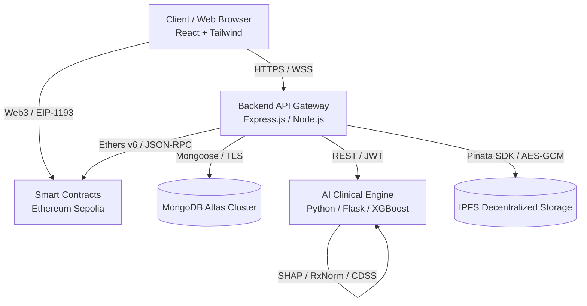

# MediChain Architecture & Subsystem Specification
**Version:** 3.0.0 Production  
**Network:** Ethereum Sepolia (Chain ID `11155111`)  
**Frontend Deployment:** `https://medichain-henna.vercel.app`  
**Backend Deployment:** `https://medichain-1-sjnc.onrender.com`  
**AI Microservice:** `https://medichain-ai.onrender.com`  

---

## 1. High-Level Architecture Overview

---

## 2. Subsystems Breakdown

### A. Frontend Layer (`/frontend`)
- **Framework**: React 18 with React Router v6.
- **Styling**: TailwindCSS with curated healthcare design system tokens (`hc-blue`, `hc-teal`, `hc-success`, `hc-card`).
- **Web3 Interface**: Ethers.js v6 with window.ethereum provider, Sepolia network guard (`chainId: 11155111`).
- **QR Scanner**: `@zxing/library` continuous video stream decoder with rear-camera preference (`facingMode: environment`) and desktop webcam fallback.
- **Key Modules**: Patient Portal, Clinical Station, Prescription Studio, CDSS Intelligence Center, Digital Twin, Medical History.

### B. Backend API Layer (`/backend`)
- **Runtime**: Node.js with Express v5.
- **Security Middleware**: Helmet, Express-Mongo-Sanitize, XSS-Clean, HPP, Express-Rate-Limit.
- **Authentication**: JWT token authorization, bcrypt password hashing, token blocklisting, audit trails.
- **Storage Pipeline**: Client multipart upload $\rightarrow$ Multer in-memory buffer $\rightarrow$ Magic bytes validation $\rightarrow$ AES-256-GCM encryption $\rightarrow$ Pinata IPFS upload $\rightarrow$ MongoDB metadata anchoring $\rightarrow$ Ethereum event logging.
- **Audit System**: Unified append-only immutable audit logging on sensitive healthcare operations.

### C. AI / CDSS Microservice (`/ai`)
- **Engine**: Flask Application Factory with Gunicorn WSGI.
- **Ensemble Machine Learning**: XGBoost, LightGBM, CatBoost, Scikit-Learn models for 7 disease vectors (Heart Disease, Diabetes, Stroke, Kidney Disease, Liver Disease, Cancer, Medication Adherence).
- **Clinical Safety Rules**: Deterministic RxNorm interaction database, contraindication checkers, organ toxicity warnings, dosage safety verification.
- **Explainability**: SHAP (SHapley Additive exPlanations) feature attribution with deterministic clinical fallbacks.

### D. Decentralized Blockchain Layer (`/blockchain`)
- **Contract**: `MediChain.sol` written in Solidity `^0.8.20`.
- **Functions**: Patient Identity registry, Doctor Access Control (permanent and timed), Emergency Access Control, Deactivation controls, Prescription report hash anchoring.
- **Test Coverage**: 46 automated Hardhat test specs covering all security boundaries, reentrancy guards, and access modifiers.

---

## 3. Production Environment & Security Configuration

| Subsystem | Service / Technology | Production Endpoint / Identifier |
| :--- | :--- | :--- |
| **Frontend** | Vercel Serverless | `https://medichain-henna.vercel.app` |
| **Backend** | Render Web Service | `https://medichain-1-sjnc.onrender.com` |
| **AI Service**| Render Web Service | `https://medichain-ai.onrender.com` |
| **Database** | MongoDB Atlas M0/M10 | TLS Replica Set (Encrypted at rest) |
| **IPFS** | Pinata Gateway | `https://gateway.pinata.cloud/ipfs/` |
| **Smart Contract**| Ethereum Sepolia | `11155111` (Contract deployed on Sepolia) |
