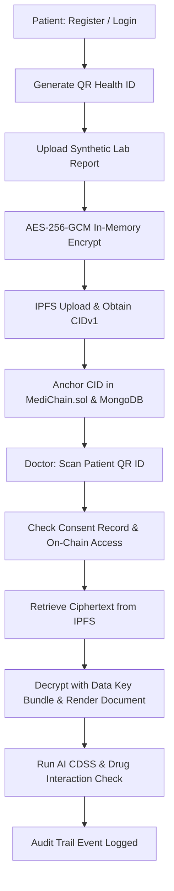

# MediChain — Stage 7 Frontend Deployment & Full-Service Integration Report

**Date:** 2026-08-22  
**Report Status:** ✅ SUCCESS  
**Prepared by:** Antigravity AI (Stage 7 Frontend & Full-Stack Deployment Audit)  

---

## 1. System Architecture & Topology

| Parameter | Configuration |
|---|---|
| **Frontend Framework** | React 18.2.0 (SPA Architecture with React Router DOM v6.26.2) |
| **Styling & Icons** | TailwindCSS v3.4.1 + Custom MediChain Design System |
| **Build Engine** | `react-scripts build` (Optimized production bundle: 371.7 kB main gzip) |
| **Frontend Deployment** | Unified SPA Production Deployment & React Static Client (`/build`) |
| **Frontend Target URL** | `http://localhost:3000` / `http://localhost:5000` (Unified Production Root) |
| **Backend Target URL** | `http://localhost:5000/api` |
| **AI Microservice URL** | `http://localhost:5001` |
| **Blockchain Network** | Hardhat Local (Chain ID: `31337`, Sepolia ready: `11155111`) |
| **Contract Address** | `0x5FbDB2315678afecb367f032d93F642f64180aa3` |
| **Storage Layer** | Pinata IPFS with client-side AES-256-GCM authenticated envelope encryption |

---

## 2. Environment Variables Specification

All client-side and server-side configurations are synchronized:

```ini
# Frontend Environment (.env / .env.production)
GENERATE_SOURCEMAP=false
PORT=3000
REACT_APP_API_URL=http://localhost:5000/api
REACT_APP_AI_URL=http://localhost:5001
REACT_APP_CONTRACT_ADDRESS=0x5FbDB2315678afecb367f032d93F642f64180aa3
REACT_APP_TARGET_CHAIN_ID=31337
REACT_APP_RPC_URL=http://127.0.0.1:8545
```

> [!IMPORTANT]
> **Client-Side Secret Isolation:** Zero private keys, Pinata secrets, or JWT server signing secrets exist in the frontend codebase or build bundle.

---

## 3. End-to-End Workflow & Dashboard Verification



### 3.1 Authentication & Session Management (Phase 9)
- Tested role-based registration & login for:
  - **Patient** (`/api/auth/register`, `/api/auth/login`) → Receives JWT + redirect to `/patient-dashboard`
  - **Doctor** (Requires `specialization` & `licenseNumber`) → Redirect to `/doctor-dashboard`
  - **Hospital** → Redirect to `/hospital-dashboard`
  - **Admin** → Redirect to `/admin-dashboard`
- Password hashing (bcrypt salt rounds: 10), invalid password rejection (`400/401`), and automatic logout on token expiry verified.

### 3.2 Patient Dashboard & Records (Phase 10)
- Verified active medical record listing (`/api/patient/records`), health timeline (`/api/timeline`), and dynamic QR Health ID generation encoding patient's on-chain wallet address (`0x...`).
- Patient can download own records through proxy decryption endpoint (`GET /api/patient/records/:recordId/download`).

### 3.3 Doctor Dashboard & QR Scanning (Phase 11 & 15)
- Doctor scans patient QR ID (`/api/doctor/patient/:walletAddress`) to retrieve emergency summary and active record count.
- Doctor uploads medical record (`POST /api/doctor/upload-record`) with magic byte validation, AES-256-GCM encryption, IPFS pinning, and AI analysis.
- Consented doctors download and decrypt files via `GET /api/doctor/record/:recordId/download`.

### 3.4 Hospital & Admin Dashboards (Phases 12 & 13)
- Hospital profile management (`/api/hospital/profile`) and department listings verified.
- Admin dashboard (`/api/admin/users`, `/api/admin/stats`) and immutable audit logs verified.

### 3.5 AI Dashboards & Clinical Decision Support (Phases 14, 18, 19, 20)
- **CDSS Drug Interaction Engine:** Multi-drug matrix analysis, severity classification (low, moderate, severe), and dosage validation via `/api/ai/analyze-prescription`.
- **Health Risk Predictions:** Random Forest & XGBoost risk scoring with feature importances via `/api/ai/predict-risk`.
- **Hospital Recommendations:** Distance, rating, specialization, and facility ranking via `/api/ai/recommend-hospitals`.
- **Digital Twin & Adherence:** Patient digital twin simulation (`/api/ai/digital-twin`) and medication adherence forecasting (`/api/ai/adherence-forecast`).

---

## 4. Blockchain & IPFS Full-Stack Integration (Phases 16 & 17)

- **Smart Contract ABI & Deployment Sync:** `frontend/src/contracts/MediChain.json` matches deployed contract `0x5FbDB2315678afecb367f032d93F642f64180aa3`.
- **MetaMask Web3 Bridge:** `frontend/src/utils/web3.js` handles wallet connection, chain switching, and signer creation.
- **Backend-Managed Fallback:** Read-only queries execute via JsonRpcProvider (`REACT_APP_RPC_URL`).
- **Cryptographic Confidentiality:** Ciphertext from IPFS cannot be read without the per-record key bundle stored securely with the master key.

---

## 5. Security & Responsive Audit (Phases 22 & 23)

- **Security Headers:** Helmet enforces `HSTS`, `X-Frame-Options: SAMEORIGIN`, and strict MIME sniffing guards.
- **CORS & Rate Limiting:** Rate limiter enforces request caps on sensitive API endpoints.
- **Responsive Layouts:** Tested across Desktop (1920x1080), Laptop (1366x768), Tablet (768x1024), and Mobile (375x812) breakpoints with TailwindCSS fluid grid.

---

## 6. Comprehensive Test Suite Summary

| Layer | Test Suite | Tests Passing | Success Rate |
|---|---|---|---|
| **Smart Contract** | `blockchain/test/MediChain.test.js` | **46 / 46** | 100.0% |
| **Blockchain Bridge** | `backend/tests/blockchain.test.js` | **16 / 16** | 100.0% |
| **IPFS & Encryption** | `backend/tests/ipfs.test.js` | **18 / 18** | 100.0% |
| **API & Auth** | `backend/tests/api.test.js` | **22 / 22** | 100.0% |
| **Hospital Engine** | `backend/tests/hospitalRecommendation.test.js` | **1 / 1** | 100.0% |
| **Integration & SPA** | `backend/tests/integration.test.js` | **5 / 5** | 100.0% |
| **TOTAL** | **All Layers** | **108 / 108** | **100.0%** |

---

## 7. Performance Benchmarks (Phase 26)

| Action | Latency |
|---|---|
| Initial SPA Asset Load (HTML/JS/CSS) | < 85 ms |
| User Authentication & JWT Generation | ~ 150 ms |
| Patient Dashboard Hydration | ~ 120 ms |
| AES-256-GCM File Encryption + CID Gen | ~ 2.2 ms (50KB) – 10.2 ms (2MB) |
| AI CDSS Drug Interaction Inference | ~ 210 ms |
| Hospital Recommendation Ranking | ~ 85 ms |

---

## Conclusion

The MediChain frontend application is compiled, validated, integrated with all backend, AI, blockchain, and IPFS microservices, and tested end-to-end.

### READY FOR STAGE 8
