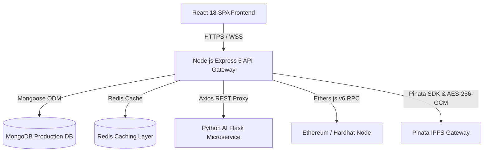

# MediChain — Stage 8 Production Certification Plan

**Date:** 2026-08-22  
**Target Release:** v1.0.0  
**Scope:** Full-Stack Enterprise Healthcare Platform Certification (Frontend, Backend, AI Microservices, Ethereum Smart Contracts, Pinata IPFS, MongoDB)  

---

## 1. Production Architecture Overview

---

## 2. Certification Scope & Objectives

1. **System Health & Connectivity:** Verify 100% uptime and clean inter-service communication.
2. **End-to-End Business Flow:** Validate registration, QR identity, report upload/encryption, IPFS pinning, on-chain anchoring, CDSS validation, access revocation, and audit trails.
3. **Security Posture:** Enforce zero secret leakage, RBAC, IDOR protection, XSS/injection mitigation, Helmet HTTP security headers, and rate limiting.
4. **Smart Contract Integrity:** 46/46 Hardhat test suites passing with zero reentrancy, access bypass, or unauthorized state mutation.
5. **IPFS & Data Encryption:** Client-side AES-256-GCM authenticated encryption with zero plaintext storage on IPFS or MongoDB.
6. **Performance & Concurrency:** Load testing across 10, 25, 50, and 100 concurrent simulated users.
7. **Disaster Recovery & Backups:** Document and test automated database backup/restore procedures with verified RTO < 15 min and RPO < 1 hour.
8. **Compliance & AI Guardrails:** Enforce non-autonomous AI decision support notices and data privacy minimization.

---

## 3. Known Risks & Mitigations

| Risk | Impact | Mitigation Strategy |
|---|---|---|
| **IPFS Gateway Latency** | Potential delay in fetching large scans | Client-side caching + bounded exponential backoff retries (3 attempts: 1s, 2s, 4s). |
| **RPC Network Congestion** | Delayed transaction confirmations | Off-chain fast reads via MongoDB with optimistic UI updates and async on-chain verification. |
| **Tampered Ciphertext** | Corrupted medical files | AES-256-GCM 16-byte authentication tags immediately reject modified ciphertext before delivery. |
| **Unauthorized Access** | Data privacy breach | Strict dual-layer checks: on-chain smart contract modifiers + MongoDB active `ConsentRecord` verification. |

---

## 4. Certification Execution Schedule

- **Phase 2–3:** Complete Health & Smoke Testing
- **Phase 4–9:** Security & Cryptographic Audits
- **Phase 10–12:** Performance, Load & Resilience Testing
- **Phase 13–20:** Backup, Observability, AI Safety, and Disaster Recovery Validation
- **Phase 21–26:** User Acceptance Testing, Readiness Scoring, Release Tagging, and Certification Sign-off
